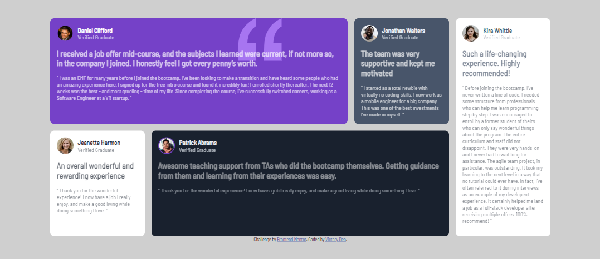

# Frontend Mentor - Testimonials grid section solution

This is a solution to the [Testimonials grid section challenge on Frontend Mentor](https://www.frontendmentor.io/challenges/testimonials-grid-section-Nnw6J7Un7). Frontend Mentor challenges help you improve your coding skills by building realistic projects.

As most of my work, this solution is being constantly updated as I learn new things and find better solutions for my problems, so please, take this into consideration. :)

## Table of contents

- [Overview](#overview)
  - [The challenge](#the-challenge)
  - [Screenshot](#screenshot)
  - [Links](#links)
- [My process](#my-process)
  - [Built with](#built-with)
- [Author](#author)

## Overview

### The challenge

Users should be able to:

- View the optimal layout for the site depending on their device's screen size

### Screenshot

### Links

[Solution](https://phoenixmputu.github.io/testimonials-grid-section/)

## My process

### Built with

- Semantic HTML5 markup
- CSS custom properties
- Flexbox
- Grid

## Author

- Frontend Mentor - [@Phoenix243](https://www.frontendmentor.io/profile/PhoenixMputu)
- Facebook [Victori deo Tshimbadi](https://web.facebook.com/profile.php?id=100009472016818)
- Stack Overflow [@Phoenix23](https://stackoverflow.com/users/15827134/phoenix23)
- LinkedIn [Victory Deo](https://www.linkedin.com/in/victory-deo-tshimbadi-a8a8b920a/)
- Instagram [Victory Deo Tshimbadi](https://www.instagram.com/victory_deo_phoenix/)
- Website [Victory Deo](https://www.victorydeo.wordifysites.com/)
